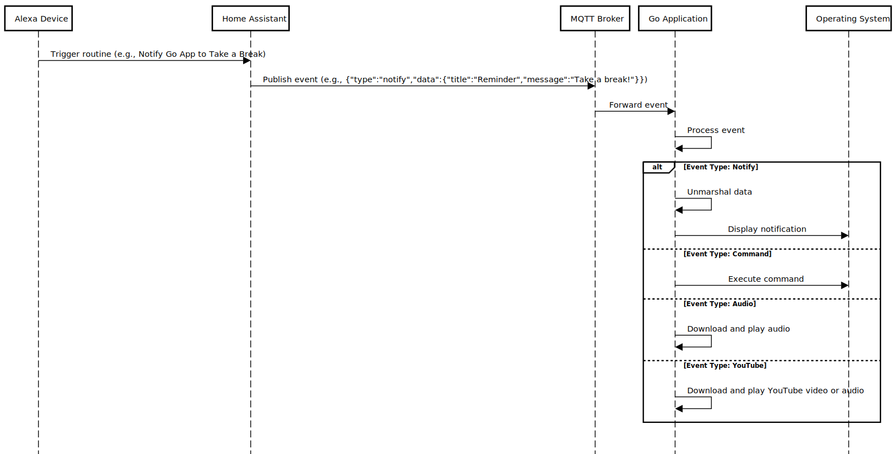

# Testing HO integration with MQTT version 3.11 with legacy protocol and HO mqtt broker

### DISCLAIMER: Ignore this repo ( this is for myself )

This project done for get me warnings about my week. Lets suppose you has a Alexa and a Home Assistant OS running in your home.
And Alexa and HO cant help me to remember me some diaries task that comes with a "adult" reponsabilities. This is a simple task manager way to integrate Alexa, HO and notify me when i am working or developing something. This working at Windows ( not test to Mac OSX yet but sometime i will do this )

### DISCLAIMER 2:

Why you created many go modules with helper as sufix. Are you OK? YES, DUDE. these helpers method will be moved for single core module after.

### Why this? 

This project done for get me warnings about my week. Lets suppose you has a Alexa and a Home Assistant OS running in your home.
I really dont know but this keeps my mind in "secure mode" to do some crazy things with my computer while a football soccer is running around me and i only have my windows notebook available and my neighbors are doing much noise. Alexa and HO has temperature sensors and small shedules diaries to help me to handle with my routine. This integration is really welcome when i need external inputs to get out myself of my mind blowing. A counter part to my sensorial disorder and my perception of time and space when i am disreguled ( i am autists and sometime my support level ups and i cant finish small priorities of my day )


# How to setup 

```sh
$ git clone github.com/brutalzinn/go-mqtt-integration
$ cd go-mqtt-integration
$ docker build -t go-mqtt-integration .
$ docker run -p 3000:3000 go-mqtt-integration
```


A nice diagram made by chatgpt to help me to explain this project to my friends and why i quit my league of legends party to do this. ( SORRY )

